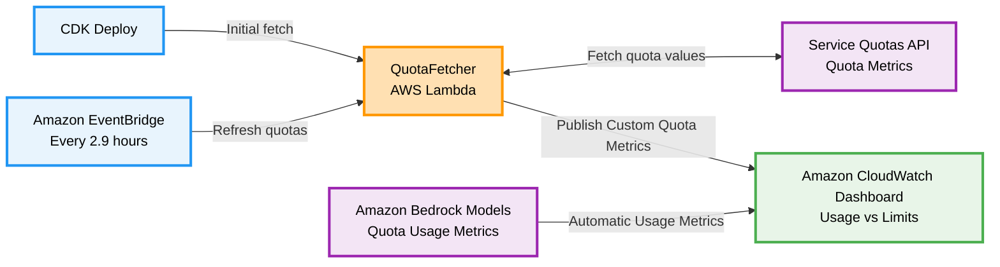

# Amazon Bedrock TPM/RPM Quota Dashboard

A CDK stack that automatically creates an Amazon CloudWatch Dashboard to monitor Amazon Bedrock model token and request per minute usage against Service Quotas.

Deployment time: 5-10 minutes. Cost: ~$12/month.

## Features

- **80+ Pre-configured Models**: Amazon Nova, Claude, Llama, Mistral, Titan, and more
- **Dual Quota Monitoring**: Tracks both token quotas (TPM) and request quotas (RPM)
- **Multi-Endpoint Support**: Regional, cross-region, and global-cross-region endpoints
- **Auto-Refresh**: Updates quota values every 2.9 hours via Amazon EventBridge
- **Visual Dashboard**: 2-column layout with red quota limit lines

## Cost Considerations

**Monthly costs (~$12):**
- Amazon CloudWatch Dashboard: $3.00
- Custom Metrics (30 metrics): $9.00 
- AWS Lambda + Amazon EventBridge: ~$0.03

**Detailed breakdown:**
- 15 active models × 2 metrics per model (TokenQuota + RequestQuota) = 30 custom metrics
- 30 metrics × $0.30/metric/month = $9.00/month
- **Cost scales directly with number of monitored models:** Each additional model adds $0.60/month (2 metrics × $0.30)

**Important notes:**
- Custom metrics persist 15 months after deletion
- When you run `npx cdk destroy`, all resources stop immediately except Amazon CloudWatch custom metrics, which persist for 15 months and incur minimal charges until expiration
- To eliminate all costs, you can manually delete metrics from the "Bedrock/Quotas" namespace in the Amazon CloudWatch console

## Prerequisites & Setup

**Requirements:**
- AWS CLI configured
- Node.js 18+ and npm
- Python 3.13 (for Lambda runtime)
- AWS CDK CLI: `npm install -g aws-cdk`
- Permissions for Amazon CloudWatch, AWS Lambda, AWS IAM, Service Quotas, Amazon EventBridge

**Deploy:**
```bash
npm install
npx cdk bootstrap  # First time only
npm run build
npx cdk deploy
```

## Architecture

### System Overview

Serverless monitoring solution that tracks Amazon Bedrock model usage against Service Quotas via Amazon CloudWatch dashboards.

### Architecture Diagram



### Key Components

- **QuotaFetcher AWS Lambda**: Fetches Service Quota values, publishes Amazon CloudWatch metrics
- **Amazon EventBridge Rule**: Refreshes quotas every 2.9 hours
- **Amazon CloudWatch Dashboard**: Displays usage vs limits with red quota lines
- **Registry System**: Separate model metadata and quota code registries

### Token Calculation

```
Total Tokens = InputTokens + CacheWriteTokens + (OutputTokens × BurndownRate)
```

Burndown rates: 1x (most models) or 5x (Claude 3.7/4 series).


## Adding New Models

### 1. Add Model Metadata
In `lib/bedrock-registries.ts`, add to `MODEL_REGISTRY`:
```typescript
'your-new-model-id': {
  outputTokenBurndownRate: 1  // 1x or 5x - see AWS docs
}
```

### 2. Add Quota Codes
Add to `QUOTA_REGISTRY`:
```typescript
'your-new-model-id': [
  { 
    endpointType: 'regional', 
    tokenQuotaCode: 'L-xxxxxxxx', 
    requestQuotaCode: 'L-yyyyyyyy' 
  }
]
```

### 3. Configure Dashboard
In `lib/cdk-quota-dashboards-stack.ts`:
```typescript
{ modelId: 'your-new-model-id', endpointType: 'regional' }
```

**Find quota codes:** `npx ts-node scripts/get-quota-codes.ts`

## Customization & Commands

**Change refresh frequency** (default: 2.9 hours):
```typescript
schedule: events.Schedule.rate(cdk.Duration.hours(6))
```

**Useful commands:**
- `npm run build` - Compile TypeScript
- `npm run test` - Run Jest tests  
- `npx cdk deploy` - Deploy to AWS
- `npx cdk diff` - Compare with deployed stack

## Security

**IAM Permissions (Least Privilege):**
- Service Quotas: Read-only, Amazon Bedrock service only
- Amazon CloudWatch: Write to `Bedrock/Quotas` namespace only
- No secrets stored, AWS IAM role-based auth only

**Data Protection:**
- HTTPS/TLS 1.2+ for all API calls
- Amazon CloudWatch encryption at rest
- Only non-sensitive quota/usage data processed

**Monitoring:**
- All API calls logged via AWS CloudTrail
- AWS Lambda execution logs in Amazon CloudWatch
- Rate limiting with exponential backoff

See [CONTRIBUTING](CONTRIBUTING.md#security-issue-notifications) for more information.

## Troubleshooting

**Quota fetch fails:**
- Check AWS IAM permissions for Service Quotas
- Verify quota codes for your region
- Check QuotaFetcher AWS Lambda logs

**No metrics showing:**
- Wait 1-2 minutes for metrics to populate
- Ensure you've invoked the models
- Verify model IDs match exactly (case-sensitive)
- Check both MODEL_REGISTRY and QUOTA_REGISTRY

**No quota limit line:**
- Wait for next refresh (every 2.9 hours)
- Check `Bedrock/Quotas` namespace in Amazon CloudWatch
- Manually invoke QuotaFetcher AWS Lambda

## Outputs

After deployment, the stack outputs:
- **DashboardURL**: Direct link to Amazon CloudWatch dashboard
- **DashboardName**: Name of the created dashboard

## Cleanup

To remove all deployed resources and stop incurring charges:

### Steps

1. Run the destroy command:

```bash
npx cdk destroy
```

2. Confirm deletion when prompted

3. Verify cleanup in AWS Console:
   - Amazon CloudWatch Dashboard: Confirm "BedrockQuotaConsumptionByModel" is deleted
   - AWS Lambda: Confirm QuotaFetcher function is removed
   - Amazon EventBridge: Confirm DailyQuotaRefresh rule is deleted
   - Amazon CloudWatch Metrics: Custom metrics in "Bedrock/Quotas" namespace will expire after 15 months

**Warning:** This action is irreversible.

**Estimated cleanup time:** 2-3 minutes

**Post-cleanup costs:** Amazon CloudWatch custom metrics may incur minimal charges ($0.30/metric) until they expire after 15 months of inactivity.

## License

This library is licensed under the MIT-0 License. See the LICENSE file.

